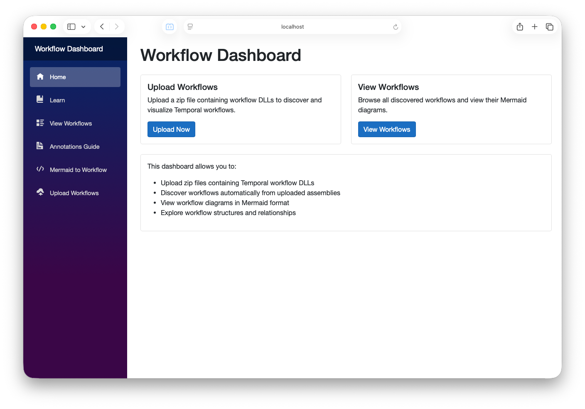
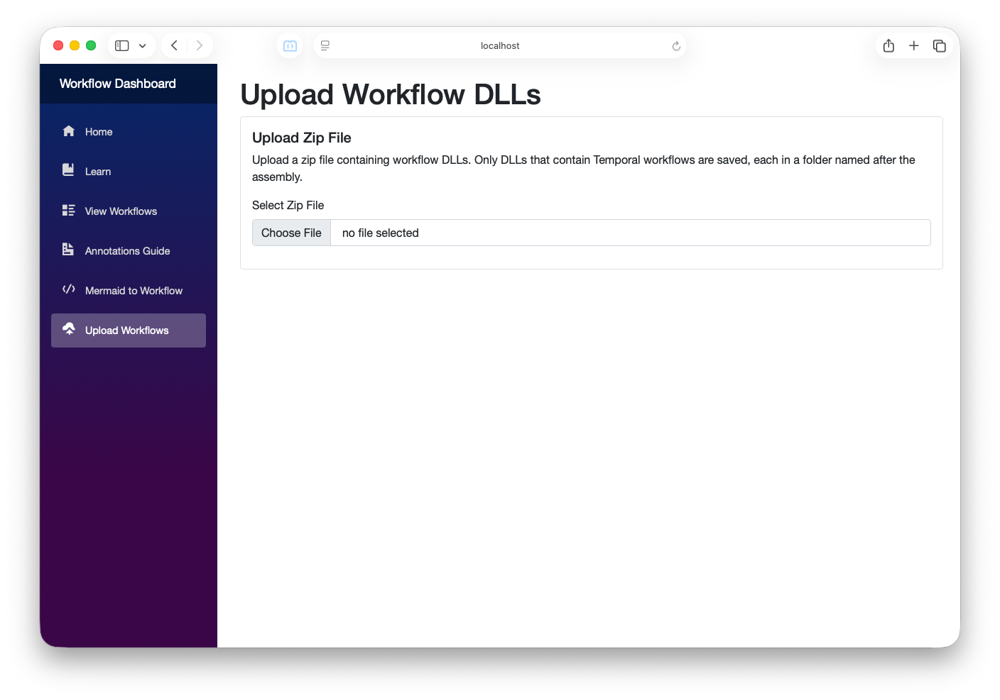
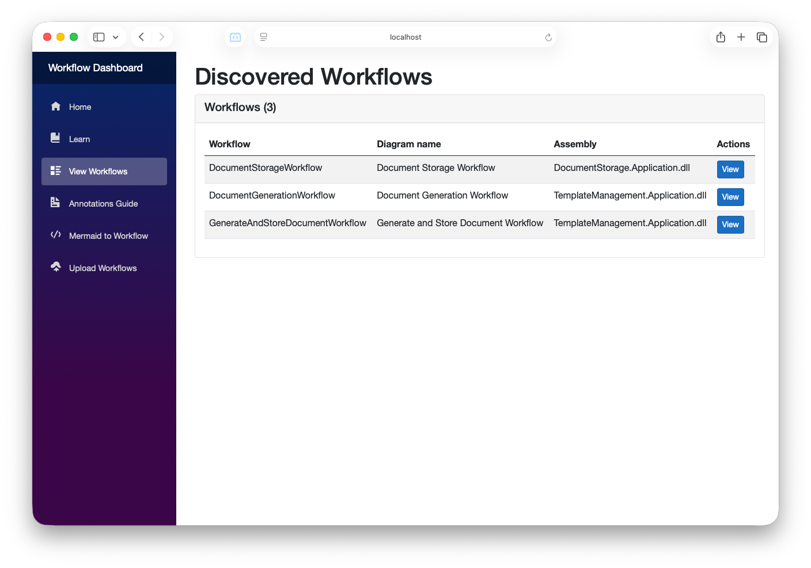
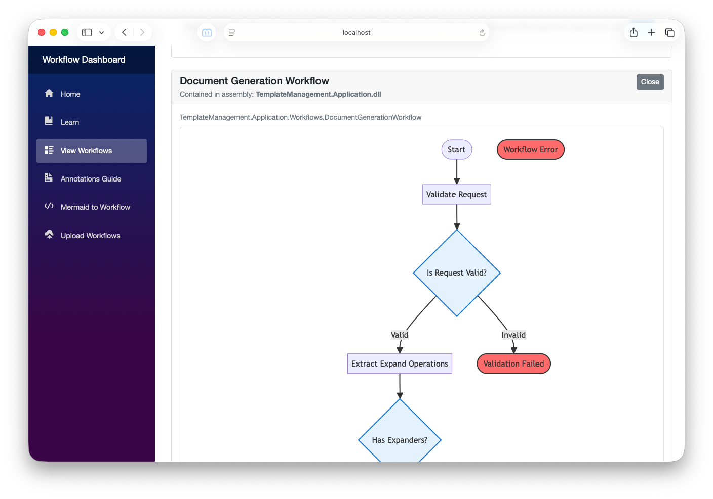
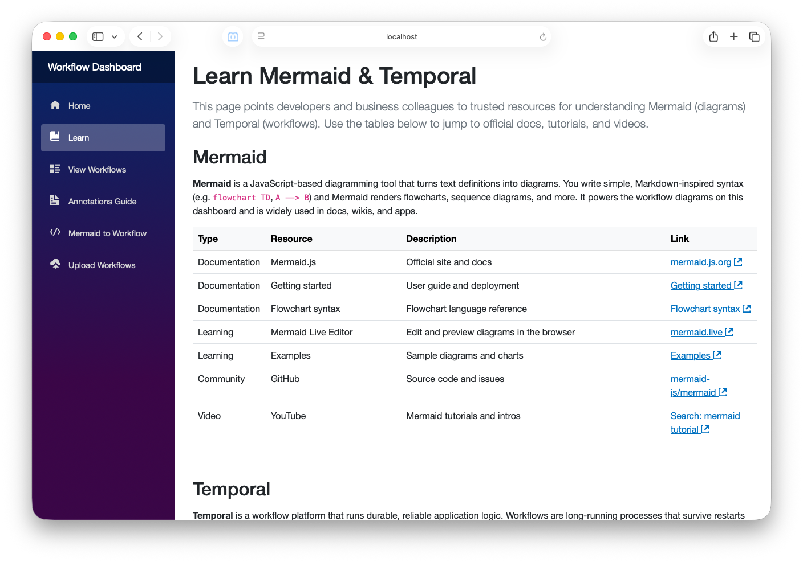
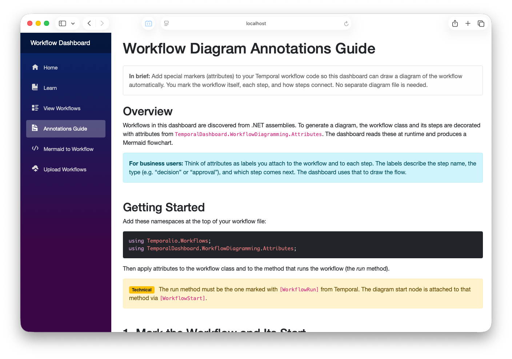
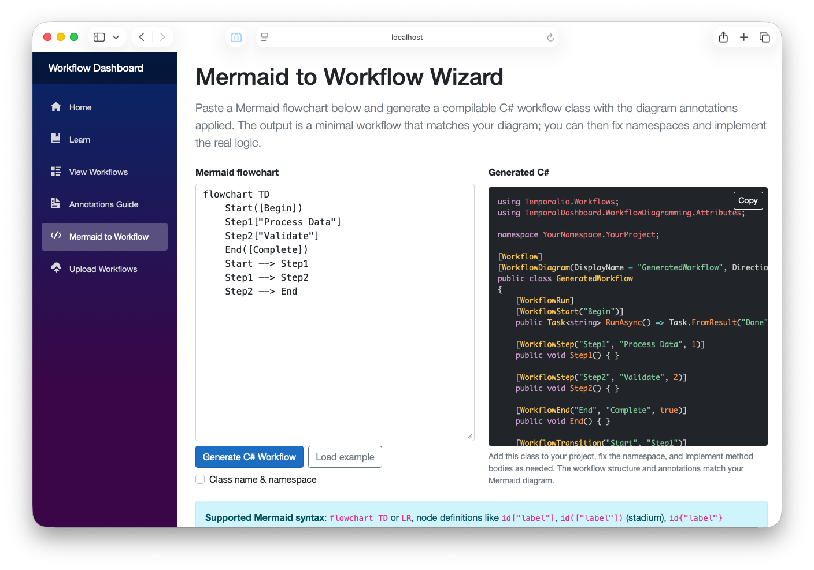

# Temporal Dashboard

A web application for discovering and visualizing [Temporal](https://temporal.io/) workflows from .NET assemblies. Upload a zip of workflow DLLs, and the dashboard discovers workflow types, inspects their diagramming attributes, and renders **Mermaid** flowcharts so you can see workflow structure without reading code.

---

## What is Temporal?

[Temporal](https://temporal.io/) is an open-source workflow engine that lets you write durable, long-running business logic as code. Instead of hand-rolling state machines, retries, and timers, you define **workflows** (the overall orchestration) and **activities** (the units of work). Temporal handles execution, retries, timeouts, and persistence so workflows survive process restarts and failures. It supports multiple languages and SDKs, including .NET. This dashboard works with **Temporal .NET workflows**: it loads your workflow assemblies and generates diagrams from the workflow structure so you can see and share how your workflows are defined without running them.

---

## What This Project Does

- **Upload** zip files containing one or more .NET DLLs that define Temporal workflows.
- **Discover** workflow types by loading assemblies (in isolated contexts) and reflecting on `[Workflow]` and diagramming attributes.
- **Visualize** workflows as Mermaid flowcharts (steps, decisions, branches, human approvals, etc.) in the browser.
- **Learn** how to annotate your own workflows for diagramming via the in-app Annotations Guide and **Mermaid to Workflow** wizard.

The dashboard does **not** run or execute workflows; it only inspects workflow types and generates diagrams from metadata (attributes).

**NuGet:** The diagramming library and build task will be published as NuGet packages (`TemporalDashboard.WorkflowDiagramming`, `TemporalDashboard.WorkflowDiagramming.Build`). You can add them to any workflow project; the Build package wires the MSBuild task automatically so diagrams are generated at build time. Use the install script to add both packages in one step—see [scripts/README.md](scripts/README.md).

---

## Architecture Overview

```
┌─────────────────────────────────────────────────────────────────────────┐
│  TemporalDashboard.Web (Blazor Server)                                    │
│  • Upload UI, workflow list, diagram viewer                              │
│  • Learn, Annotations Guide, Mermaid-to-Workflow wizard                  │
│  • Calls API via HttpClient (ApiClient)                                   │
└───────────────────────────────────┬─────────────────────────────────────┘
                                    │ HTTP
                                    ▼
┌─────────────────────────────────────────────────────────────────────────┐
│  TemporalDashboard.Api (ASP.NET Core)                                    │
│  • POST /api/upload/zip  → extract zip, keep workflow DLLs, store       │
│  • GET /api/workflows    → discover all workflows from uploads          │
│  • GET /api/workflows/{dll}/diagrams → Mermaid for each workflow in DLL  │
│  • WorkflowDiscoveryService: loads DLLs in collectible ALC, reflects      │
└───────────────────────────────────┬─────────────────────────────────────┘
                                    │ uses
                                    ▼
┌─────────────────────────────────────────────────────────────────────────┐
│  TemporalDashboard.WorkflowDiagramming (class library)                   │
│  • Attributes: [WorkflowDiagram], [WorkflowStep], [WorkflowDecision],   │
│    [WorkflowBranch], [WorkflowTransition], [WorkflowStart], [WorkflowEnd]│
│  • WorkflowDiagramGenerator.GenerateMermaidDiagram(workflowType)         │
│  • Depends on Temporalio (for [Workflow]/[WorkflowRun] detection only)   │
└─────────────────────────────────────────────────────────────────────────┘
```

- **Web** and **Api** are separate processes (different ports). In Docker, the web app talks to the API using the service name and internal port.
- **WorkflowDiagramming** has no dependency on ASP.NET; it is a pure library used by the API (and by the Web project for the Mermaid-to-Workflow wizard).

---

## UI Overview

The app is a Blazor Server UI with a top nav bar and several main pages. Below is how each screen looks and what it does. Screenshots use placeholders you can replace with real captures (see [docs/screenshots/README.md](docs/screenshots/README.md)).

### Navigation

The sidebar/top nav includes: **Home**, **Learn**, **View Workflows**, **Annotations Guide**, **Mermaid to Workflow**, and **Upload Workflows**. Use **Upload Workflows** first to add a zip of workflow DLLs, then **View Workflows** to see and diagram them.

### Home

Landing page with two cards: **Upload Workflows** (go to upload) and **View Workflows** (go to the workflow list). A short bullet list explains what the dashboard does.



### Upload Workflows

Upload a zip file containing workflow DLLs. Choose a file with the file picker; the app uploads it to the API, which extracts it and keeps only DLLs that contain Temporal workflows (each in a folder named by assembly). Success and error messages appear below the picker. If an assembly folder already exists, you can choose to overwrite or cancel.



### View Workflows

Table of all discovered workflows: workflow name, diagram display name, and assembly (DLL). Each row has a **View** button that loads the Mermaid diagram for that workflow.



### Workflow Diagrams

When you click **View** on a workflow, a card opens showing the workflow’s Mermaid flowchart (steps, decisions, branches, etc.). You can close it to return to the table. Diagrams are generated from the workflow’s diagramming attributes.



### Learn

Intro/learning content about the dashboard and Temporal workflow diagramming.



### Annotations Guide

Reference for the C# attributes used to drive diagram generation (`[WorkflowDiagram]`, `[WorkflowStep]`, `[WorkflowTransition]`, etc.). Use this when annotating your own workflows.



### Mermaid to Workflow

Wizard that helps you go from a Mermaid flowchart to C# workflow code (or understand how Mermaid maps to attributes). Useful when designing new workflows or reverse-engineering a diagram.



---

## Repository Structure

```
temporalDashboard/
├── src/
│   ├── TemporalDashboard.WorkflowDiagramming/   # Core diagramming (attributes + Mermaid generator)
│   │   ├── Attributes/                           # [WorkflowDiagram], [WorkflowStep], etc.
│   │   ├── WorkflowDiagramGenerator.cs           # Reflection → Mermaid string
│   │   └── README.md                             # Library overview
│   ├── TemporalDashboard.WorkflowDiagramming.Build/  # MSBuild task: generate .mermaid at build time
│   │   ├── GenerateWorkflowDiagramsTask.cs       # Custom MSBuild task
│   │   └── TemporalDashboard.WorkflowDiagramming.Build.targets
│   ├── TemporalDashboard.Api/                    # REST API (upload + workflow discovery)
│   │   ├── Controllers/                          # UploadController, WorkflowsController
│   │   ├── Services/                             # WorkflowDiscoveryService (DLL load + reflect)
│   │   ├── Models/                               # WorkflowInfo, WorkflowTypeInfo, WorkflowDllInfo
│   │   └── Program.cs
│   └── TemporalDashboard.Web/                   # Blazor Server UI
│       ├── Pages/                                # Index, Upload, Workflows, Learn, Wizard, AnnotationsGuide
│       ├── Services/                             # ApiClient, MermaidToWorkflowGenerator
│       ├── Shared/                               # MainLayout, NavMenu
│       └── wwwroot/                              # CSS, static assets
├── tests/
│   └── TemporalDashboard.WorkflowDiagramming.Tests/
│       ├── Workflows/                            # Sample workflows used in tests
│       └── *Tests.cs                             # Unit tests for attributes and generator
├── .github/
│   └── workflows/
│       └── ci.yml                                # Build and test on push/PR
├── docs/
│   └── screenshots/                              # UI screenshots for README (replace placeholders)
├── CONTRIBUTING.md                                # How to contribute
├── CODE_OF_CONDUCT.md                             # Contributor Covenant
├── SECURITY.md                                    # How to report vulnerabilities
├── CHANGELOG.md                                   # Version history
├── TemporalDashboard.sln
├── docker-compose.yml                            # Web + API + volumes
├── DOCKER.md                                     # Docker usage and ports
├── WORKFLOW_ATTRIBUTES_GUIDE.md                  # Full guide to annotating workflows
├── LICENSE                                       # MIT license
└── README.md                                     # This file
```

---

## Projects at a Glance

| Project | Purpose |
|--------|---------|
| **TemporalDashboard.WorkflowDiagramming** | Defines C# attributes for workflow diagram metadata and generates Mermaid flowchart text from workflow types. No UI or HTTP. |
| **TemporalDashboard.WorkflowDiagramming.Build** | MSBuild task that runs at build time to generate `.mermaid` files from a workflow assembly so you can ship diagram content without sharing the DLL. See `src/TemporalDashboard.WorkflowDiagramming.Build/README.md`. |
| **TemporalDashboard.Api** | ASP.NET Core API: upload zip, list workflows, get Mermaid diagrams per DLL. Uses WorkflowDiscoveryService to load DLLs (with isolated load contexts) and call the diagramming library. |
| **TemporalDashboard.Web** | Blazor Server app: upload page, workflow list, diagram viewer, Learn, Annotations Guide, Mermaid-to-Workflow wizard. Depends on WorkflowDiagramming; calls API via `ApiClient`. |
| **TemporalDashboard.WorkflowDiagramming.Tests** | Unit tests for attributes and `WorkflowDiagramGenerator`; includes sample workflow classes under `Workflows/`. |

---

## Prerequisites

- **.NET 10.0 SDK** (for local build and run).  
  Check: `dotnet --version`
- **Docker Desktop** (or Docker Engine + Docker Compose) if you want to run via Docker.

---

## Getting Started

### Option 1: Docker (recommended for first run)

1. From the repo root:
   ```bash
   docker-compose up --build
   ```
2. Open **http://localhost:8000** in your browser.
3. Use **Upload Workflows** to upload a zip of workflow DLLs, then **View Workflows** and **View Diagrams**.

See **[DOCKER.md](DOCKER.md)** for ports, volumes, env vars, and troubleshooting.

### Option 2: Local development

1. **Start the API** (from repo root):
   ```bash
   cd src/TemporalDashboard.Api && dotnet run
   ```
   API: **https://localhost:7001** (or the port shown in the console.)

2. **Start the Web app** (second terminal):
   ```bash
   cd src/TemporalDashboard.Web && dotnet run
   ```
   Web: **https://localhost:7000** (or the port shown.)

3. Ensure the Web app’s `ApiBaseUrl` points to the API (see [Configuration](#configuration) below).

4. Open **https://localhost:7000** and use Upload Workflows → View Workflows → View Diagrams.

---

## Building and Testing

From the solution root:

```bash
# Build everything
dotnet build

# Run all tests
dotnet test
```

To run only the diagramming tests:

```bash
dotnet test tests/TemporalDashboard.WorkflowDiagramming.Tests/TemporalDashboard.WorkflowDiagramming.Tests.csproj
```

---

## Configuration

### API (`src/TemporalDashboard.Api`)

- **UploadsPath** – Directory where uploaded zips are extracted (each DLL gets a folder named by assembly). Default: `uploads` under the API working directory.
- In Docker, this is typically something like `/app/uploads` and backed by a volume.

### Web (`src/TemporalDashboard.Web`)

- **ApiBaseUrl** – Base URL of the API (e.g. `https://localhost:7001` for local, or `http://api:8080` when the Web runs in Docker and calls the API service).

Edit `appsettings.json` or `appsettings.Development.json` as needed.

---

## API Endpoints

| Method | Path | Description |
|--------|------|-------------|
| POST | `/api/upload/zip` | Upload a zip file; optional query `overwrite=true` to replace existing assembly folders. |
| GET | `/api/workflows` | List all discovered workflows (from all uploaded DLLs). |
| GET | `/api/workflows/{dllName}/diagrams` | Get workflow types and Mermaid diagram text for the given DLL. |
| GET | `/api/upload/info` | Info about uploaded folders/files. |

---

## How Workflow Discovery Works

1. User uploads a **zip** via the Web UI → API receives it.
2. API extracts the zip to a temp folder and uses `WorkflowDiscoveryService` to find DLLs that contain at least one `[Workflow]` type (via a quick scan).
3. For each such DLL, the API copies it (and dependencies) into a dedicated folder under `UploadsPath`, named by the main assembly (file-name safe).
4. When listing workflows or diagrams, the API loads only the **main** DLL for each folder (e.g. `MyWorkflows/MyWorkflows.dll`) in a **collectible AssemblyLoadContext** so multiple versions of the same assembly name don’t collide. Diagramming and Temporal types are resolved from the default context so attribute reflection matches.
5. The service discovers types with `[Workflow]` and our diagramming attributes, then calls `WorkflowDiagramGenerator.GenerateMermaidDiagram(type)` to produce Mermaid text.
6. The Web app displays that text (e.g. via a Mermaid.js renderer) for each workflow.

Workflows must be annotated with the diagramming attributes to get meaningful diagrams; see **[WORKFLOW_ATTRIBUTES_GUIDE.md](WORKFLOW_ATTRIBUTES_GUIDE.md)**.

---

## Documentation for Developers

- **[WORKFLOW_ATTRIBUTES_GUIDE.md](WORKFLOW_ATTRIBUTES_GUIDE.md)** – How to annotate workflows with `[WorkflowDiagram]`, `[WorkflowStep]`, `[WorkflowTransition]`, etc., and how diagram generation uses them.
- **[DOCKER.md](DOCKER.md)** – Docker Compose services, ports, environment variables, and common commands.
- **src/TemporalDashboard.WorkflowDiagramming/README.md** – Overview of the diagramming library and its attributes.
- **src/TemporalDashboard.WorkflowDiagramming.Build/README.md** – Build-time diagram generation: use the MSBuild task to emit `.mermaid` files when building your workflow project.
- **src/TemporalDashboard.WorkflowDiagramming/Attributes/ATTRIBUTES_SUMMARY.md** – Short summary of the attribute set and design.

---

## For New Developers: Working With and Extending the Codebase

### Making changes

- **Diagramming logic** – Edit `WorkflowDiagramGenerator.cs` and the types in `Attributes/`. Add or adjust attributes in `Attributes/` and update the generator to read them. Add tests in `TemporalDashboard.WorkflowDiagramming.Tests` (see existing `Workflows/` samples and test files).
- **API behavior** – Controllers in `TemporalDashboard.Api/Controllers`, discovery and upload logic in `Services/WorkflowDiscoveryService.cs`. Config in `appsettings.json`.
- **UI** – Blazor pages in `TemporalDashboard.Web/Pages`, layout and nav in `Shared/`, API calls in `Services/ApiClient.cs`.

### Adding a new API endpoint

1. Add the action on the appropriate controller (or create a new controller and register it).
2. If it returns new DTOs, add or reuse models under `Api/Models`.
3. Call the new endpoint from the Web app’s `ApiClient` and add or update a page to use it.

### Adding a new diagramming attribute

1. Add the attribute class under `TemporalDashboard.WorkflowDiagramming/Attributes`.
2. In `WorkflowDiagramGenerator`, read the attribute via reflection and extend the Mermaid generation (nodes/edges) accordingly.
3. Add unit tests and, if useful, a sample workflow in `tests/.../Workflows/`.
4. Update **WORKFLOW_ATTRIBUTES_GUIDE.md** and the in-app Annotations Guide so users know how to use it.

### Testing

- Run `dotnet test` before submitting changes. The diagramming tests use in-memory workflow types and do not require the API or Web to be running.
- For manual testing, use Docker or run Api + Web locally and upload a zip that contains workflow DLLs annotated with the diagramming attributes.

### Tech stack summary

- **.NET 10**, C# with nullable reference types.
- **TemporalDashboard.Api**: ASP.NET Core, minimal hosting, OpenAPI in Development.
- **TemporalDashboard.Web**: Blazor Server, Bootstrap, Open Iconic.
- **TemporalDashboard.WorkflowDiagramming**: .NET 10 class library; dependency: **Temporalio** (for `[Workflow]` / `[WorkflowRun]` only).
- **Diagram output**: Mermaid flowchart syntax, rendered in the browser (e.g. Mermaid.js).

---

## License and Contributing

- **License**: [LICENSE](LICENSE) (MIT).
- **Contributing**: See [CONTRIBUTING.md](CONTRIBUTING.md) for how to contribute (setup, PRs, tests).
- **Code of conduct**: [CODE_OF_CONDUCT.md](CODE_OF_CONDUCT.md) (Contributor Covenant).
- **Security**: See [SECURITY.md](SECURITY.md) for how to report vulnerabilities.
