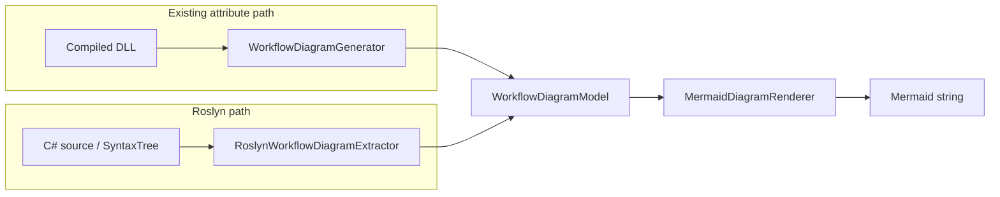
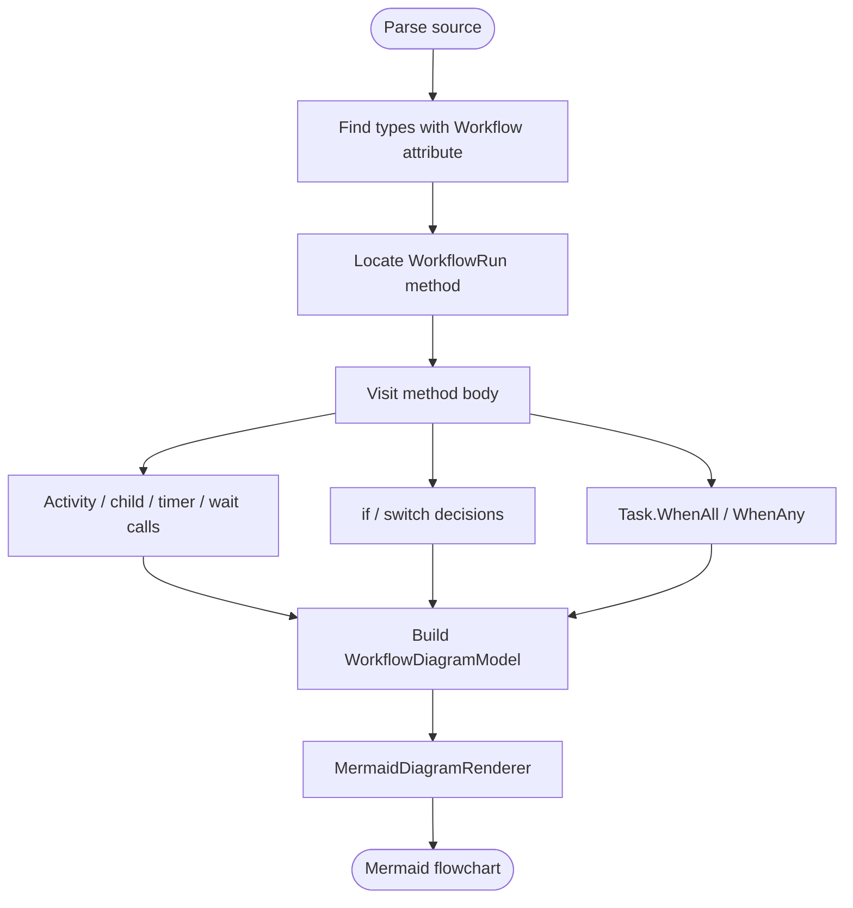

# TemporalDashboard.WorkflowDiagramming.Roslyn

Roslyn-based extractor that builds Mermaid workflow diagrams from **normal Temporal .NET workflow source** — no diagramming attributes required.

This package sits **beside** [`TemporalDashboard.WorkflowDiagramming`](../TemporalDashboard.WorkflowDiagramming/): the attribute path (DLL reflection) is unchanged. Both paths share `WorkflowDiagramModel` and `MermaidDiagramRenderer`.

## Architecture



Extraction pipeline:



## Usage

```bash
dotnet add package TemporalDashboard.WorkflowDiagramming.Roslyn
```

```csharp
using TemporalDashboard.WorkflowDiagramming.Roslyn;

var results = RoslynWorkflowDiagramExtractor.ExtractFromSource(csharpSource);

foreach (var result in results)
{
    Console.WriteLine(result.WorkflowTypeName);
    Console.WriteLine(result.Mermaid);
    foreach (var note in result.Diagnostics)
        Console.WriteLine($"  note: {note}");
}
```

Also available:

- `ExtractFromSources(IEnumerable<(string path, string text)> sources)`
- `ExtractFromCompilation(Compilation compilation)`

## V1 patterns recognized

| Pattern | Diagram mapping |
|---------|-----------------|
| `Workflow.ExecuteActivityAsync` / `ExecuteLocalActivityAsync` | Activity step (label from lambda method or string name) |
| `Workflow.ExecuteChildWorkflowAsync` | Activity-like step labeled as child workflow |
| `Workflow.DelayAsync` / `CreateTimer` | Delay step |
| `Workflow.WaitConditionAsync` | Human-approval style wait node |
| `if` / `switch` / ternary | Decision diamond + Yes/No (or case) branches |
| `Task.WhenAll` / `WhenAny` | Fan-out / fan-in with Parallel edge styling |
| Sequential statements | Linear `Start → … → End` |
| Same-type private helpers | Best-effort inline of helper body |

## Limitations (v1)

- No cycles for loops (body is approximated sequentially)
- No deep cross-class helper expansion
- Dynamic activity names and attribute enrichment are out of scope
- Not wired into Api/Web upload yet — library + tests only

## Relation to attributes

| Concern | Attributes | Roslyn |
|---------|------------|--------|
| Input | Compiled `[Workflow]` types | C# source |
| Rich labels / AI / approval roles | Yes | Approximate skeleton |
| Forces diagram-shaped code | Yes | No — normal Temporal code |
| Dashboard upload today | Yes | Not yet |

Use attributes when you need curated diagrams; use Roslyn when you want discovery from existing workflow methods.

## Roadmap

- Optional attribute overrides merged onto a Roslyn skeleton
- Api/Web source upload path
- History overlay (runtime paths vs definition)

## Build-time package

For automatic generation on `dotnet build` (no API calls), use **[TemporalDashboard.WorkflowDiagramming.Roslyn.Build](../TemporalDashboard.WorkflowDiagramming.Roslyn.Build/)**:

```bash
dotnet add package TemporalDashboard.WorkflowDiagramming.Roslyn.Build
# or: ./scripts/install-workflow-diagramming-roslyn-build.sh
```

## Tests

```bash
dotnet test tests/TemporalDashboard.WorkflowDiagramming.Roslyn.Tests/TemporalDashboard.WorkflowDiagramming.Roslyn.Tests.csproj
```
